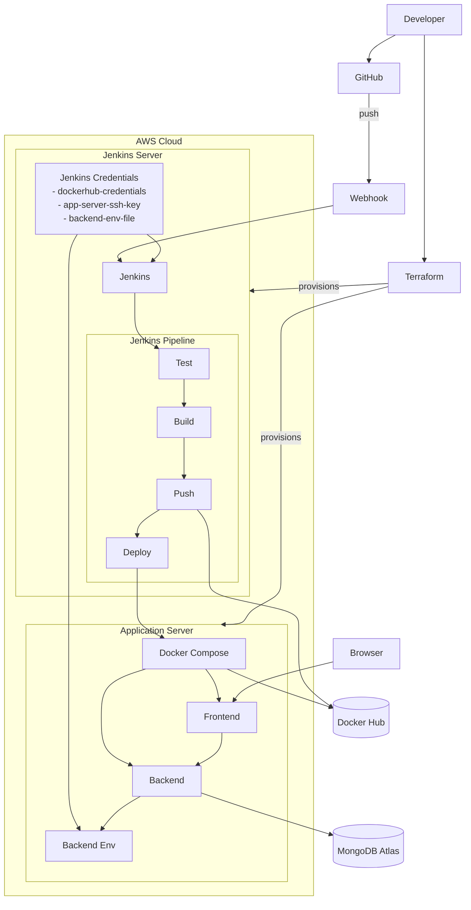
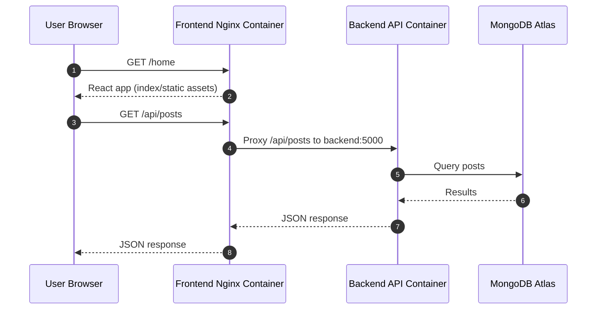

# Draftly Architecture

## Overview
This document provides a professional, presentation-ready view of the Draftly platform architecture, including runtime traffic flow and CI/CD automation.

## System Context
Draftly is a two-tier containerized web application:
- Frontend: React app served by Nginx container
- Backend: Node/Express API container
- Data: MongoDB Atlas (managed external database)

Delivery is automated through Jenkins running on a dedicated EC2 instance.

## Production Deployment Architecture

## Runtime Request Flow

## CI/CD Pipeline Flow
1. Git push to `main` triggers Jenkins via GitHub webhook.
2. Jenkins runs frontend and backend tests in parallel.
3. Jenkins builds frontend/backend Docker images.
4. Jenkins pushes versioned images to Docker Hub.
5. Jenkins deploys to app EC2 using Ansible over private VPC IP.
6. App server pulls latest images and recreates containers.
7. Post-deploy cleanup prunes unused containers and images.

## Key Design Characteristics
- Separation of concerns: CI/CD server and runtime app server are isolated.
- Deterministic releases: image tags tied to Jenkins build numbers.
- Stable service discovery: frontend proxies to backend by Docker Compose service name (`backend`).
- Secret handling: backend environment injected from Jenkins secret file during deployment.
- Automated operations: webhook-triggered pipeline and automatic Docker artifact cleanup.

## Security and Access Notes
- Jenkins webhook endpoint is internet-reachable for push-trigger automation.
- SSH deployment path uses private key credentials and private app-server IP.
- Backend secrets are not committed; generated as `backend/.env` at deploy time.
- Recommendation for production hardening: place Jenkins behind HTTPS reverse proxy and tighten direct inbound exposure.
