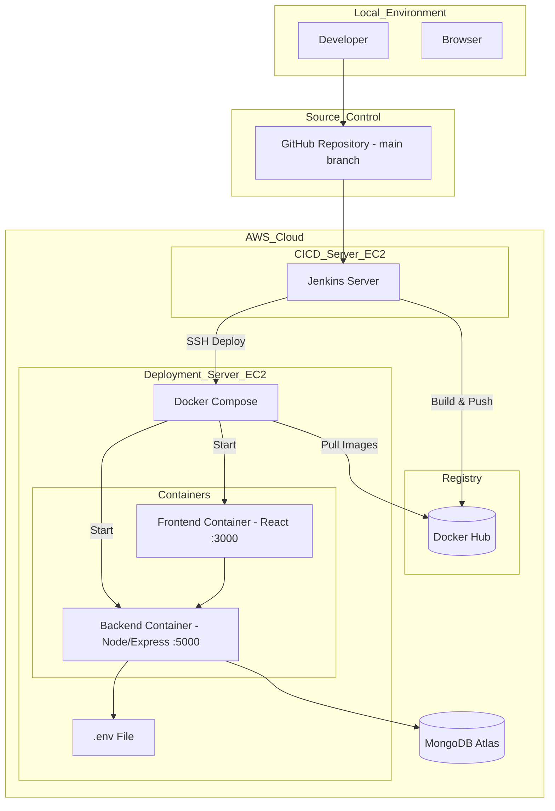

# Draftly

Draftly is a full-stack blogging application built using the MERN stack (MongoDB, Express, React, Node.js). It includes a complete CI/CD pipeline configuration using Jenkins and is containerized with Docker.

## 🚀 Features

-   **User Authentication**: Register and login securely (JWT-based).
-   **Blogging**: Create, read, and manage stories/posts.
-   **Responsive UI**: Built with React and modern CSS.
-   **Containerized**: Fully dockerized development and production environments.
-   **CI/CD**: specific Jenkins pipeline for automated building and pushing of Docker images.

## 🛠 Tech Stack

-   **Frontend**: React.js, React Router, Axios
-   **Backend**: Node.js, Express.js, Mongoose
-   **Database**: MongoDB
-   **DevOps**: Docker, Docker Compose, Jenkins

## 📋 Prerequisites

Before you begin, ensure you have the following installed:
-   [Docker](https://www.docker.com/products/docker-desktop) & [Docker Compose](https://docs.docker.com/compose/install/)
-   [Node.js](https://nodejs.org/) (if running locally without Docker)

## ⚡ Getting Started

### Option 1: Using Docker Compose (Recommended)

The easiest way to run the application is using Docker Compose.

1.  **Clone the repository**
    ```bash
    git clone https://github.com/SahanjithD/Draftly.git
    cd Draftly
    ```

2.  **Start the application (Development Mode)**
    This starts the frontend, backend, and MongoDB database with hot-reloading enabled.
    ```bash
    docker-compose -f docker-compose.dev.yml up --build
    ```

3.  **Start the application (Production Mode)**
    ```bash
    docker-compose up --build
    ```

4.  **Access the application**
    -   Frontend: [http://localhost:3000](http://localhost:3000)
    -   Backend API: [http://localhost:5000](http://localhost:5000)

### Option 2: Manual Setup

If you prefer to run the services individually on your machine:

#### Backend
1.  Navigate to the backend directory:
    ```bash
    cd backend
    ```
2.  Install dependencies:
    ```bash
    npm install
    ```
3.  Create a `.env` file (see `docker-compose.yml` for required variables like `MONGODB_URI`).
4.  Start the server:
    ```bash
    npm run dev
    ```

#### Frontend
1.  Navigate to the frontend directory:
    ```bash
    cd frontend
    ```
2.  Install dependencies:
    ```bash
    npm install
    ```
3.  Start the React app:
    ```bash
    npm start
    ```

## 📂 Project Structure

```
Draftly/
├── backend/                # Node.js/Express API
│   ├── config/             # Database configuration
│   ├── controllers/        # Request handlers
│   ├── models/             # Mongoose schemas (User, Post)
│   ├── routes/             # API routes
│   └── server.js           # Entry point
├── frontend/               # React Application
│   ├── public/             # Static assets
│   └── src/                # React components and pages
├── docker-compose.yml      # Production composition
├── docker-compose.dev.yml  # Development composition
└── Jenkinsfile             # CI/CD Pipeline definition
```

## ☁️ AWS Deployment Architecture

This project uses a dedicated AWS infrastructure for CI/CD and production deployment.



### 1. Infrastructure Overview
-   **Jenkins Server**: An EC2 instance dedicated to running the CI/CD pipeline.
-   **Deployment Server**: An EC2 instance that hosts the live application using Docker Compose.

### 2. Server Access
SSH private keys (`.pem` files) for accessing these servers are stored locally at:
`C:\Users\ASUS\.ssh`

To access the servers via SSH:
```bash
ssh -i "C:\Users\ASUS\.ssh\your-key-name.pem" admin@<SERVER_PUBLIC_IP>
```

### 3. Deployment Server Configuration
The deployment server is configured with a `docker-compose.yml` file located at `~/draftly/docker-compose.yml`.

**File Content:**
```yaml
version: "3.9"

services:
  backend:
    image: dasund3sh4j4/draftly-backend:${IMAGE_TAG}
    env_file: .env
    ports:
      - "5000:5000"

  frontend:
    image: dasund3sh4j4/draftly-frontend:${IMAGE_TAG}
    ports:
      - "3000:3000"
```
*Note: The `${IMAGE_TAG}` variable is populated during the deployment process to ensure the correct version is deployed.*

## 🔄 CI/CD Pipeline

The project includes a `Jenkinsfile` that defines the CI/CD pipeline. The pipeline includes stages for:
1.  Cloning the repository.
2.  Building Docker images for Frontend and Backend.
3.  Pushing images to Docker Hub.
4.  Deploying to the App Server.
5.  Cleaning up Jenkins images.

### 1. Accessing Jenkins
Jenkins is hosted on a dedicated AWS EC2 instance.

1.  **URL**: Navigate to `http://<JENKINS_SERVER_PUBLIC_IP>:8080` in your browser.
2.  **Initial Setup**:
    -   Connect to the server via SSH:
        ```bash
        ssh -i "path\to\your-key.pem" admin@<JENKINS_SERVER_IP>
        ```
    -   Retrieve the initial administrator password:
        ```bash
        sudo cat /var/lib/jenkins/secrets/initialAdminPassword
        # Or if running in Docker:
        docker exec jenkins-container-name cat /var/jenkins_home/secrets/initialAdminPassword
        ```
3.  **Completion**: Enter the password in the web UI, install suggested plugins, and create an admin user.

### 3. Setting Up the Pipeline
1.  **Create a Job**: Click "New Item", enter a name (e.g., "Draftly-Pipeline"), select **Pipeline**, and click OK.
2.  **Configure Pipeline**:
    -   Scroll down to the **Pipeline** section.
    -   Definition: **Pipeline script from SCM**.
    -   SCM: **Git**.
    -   Repository URL: `https://github.com/SahanjithD/Draftly.git`
    -   Branch Specifier: `*/main`
    -   Script Path: `Jenkinsfile`
3.  **Credentials**: 
    -   Go to **Dashboard > Manage Jenkins > Credentials**.
    -   Add a new "Username with password" credential.
    -   **ID**: `dockerhub-credentials` (This must match the ID used in the `Jenkinsfile`).
    -   **Username/Password**: Your Docker Hub login details.
4.  **Run**: Go to the job dashboard and click **Build Now**.

### 4. Docker Hub Artifacts
Once the pipeline completes successfully, the images will be available on Docker Hub:
-   **Frontend**: [dasund3sh4j4/draftly-frontend](https://hub.docker.com/r/dasund3sh4j4/draftly-frontend)
-   **Backend**: [dasund3sh4j4/draftly-backend](https://hub.docker.com/r/dasund3sh4j4/draftly-backend)

## 📖 Documentation

-   **API Documentation**: See `backend/API_DOCUMENTATION.md` for details on available endpoints.
-   **Run Instructions**: See `ReadBeforeRun.md` for specific execution details.
